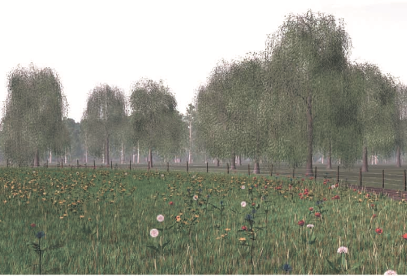

# color_transfer

Color Transfer Between images[^1]の実装をしました．
入力画像の色味を参照画像の色味に近づける画像処理アルゴリズムです．

実行方法
```
python3 color_transfer. py source_img_path target_img_path save_dir/
```

アルゴリズムの詳細は[qiita][2]に書きました．

# 実行結果
|入力画像|参照画像|実行結果|入力画像と参照画像を逆に|論文中の結果|
|---|---|---|---|---|
||||||
||||||

実行結果は入力画像の色を参照に近づけた結果です．
イラストに適応した結果です．
|入力画像|参照画像|結果1|結果2|
|---|---|---|---|
||||


[1]:https://www.cs.tau.ac.il/~turkel/imagepapers/ColorTransfer.pdf

[2]:https://qiita.com/wkiino/items/f4a8f340016951107646


